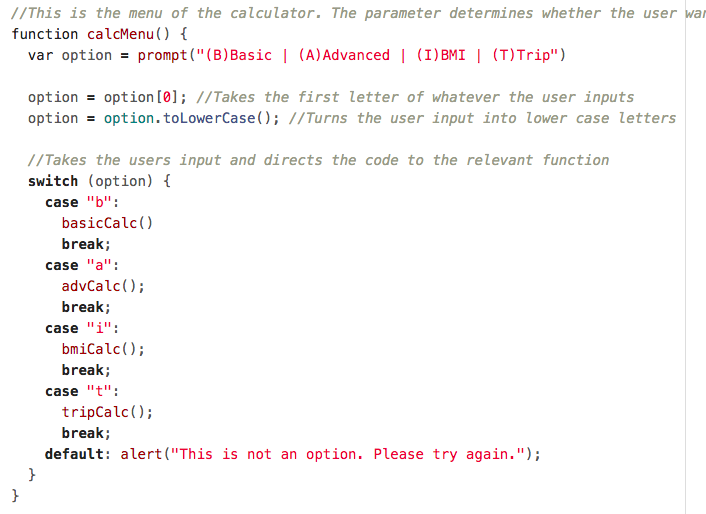
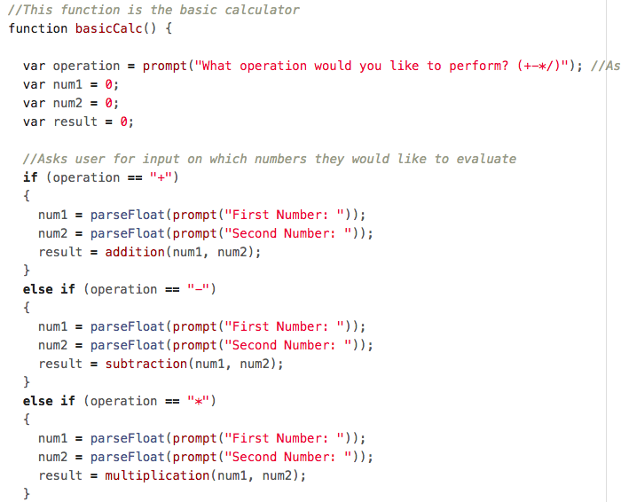
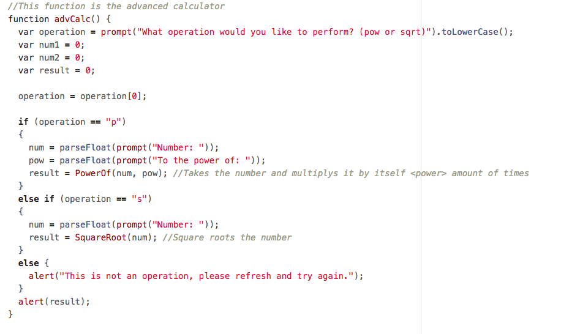
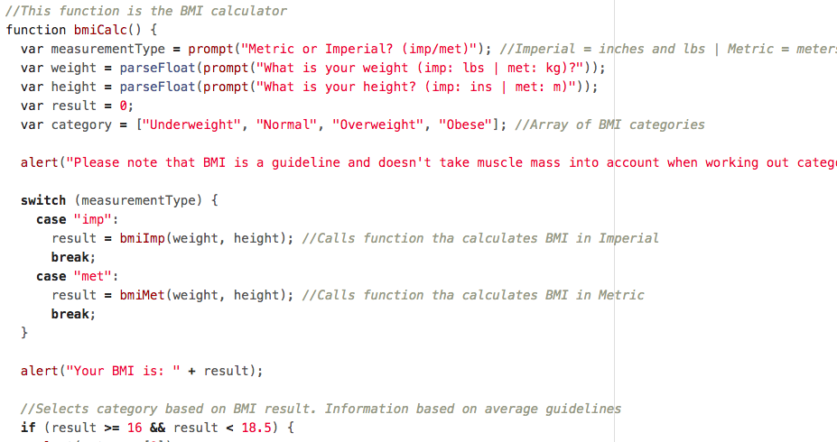
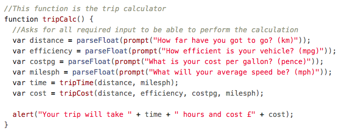
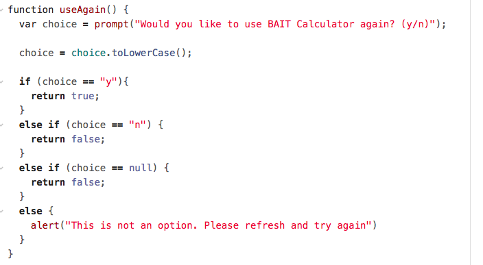
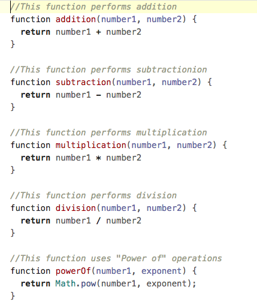
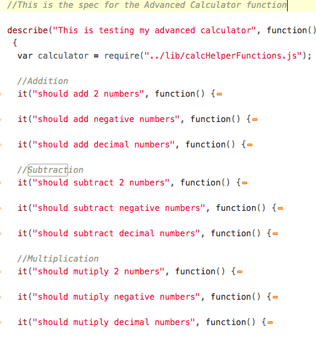

# Advanced calculator

This is an advanced calculator project, written in JavaScript.

## How to use

### Windows

1. Fork the repo
2. Download or Clone your fork
3. Find the folder in explorer
4. Go into the lib folder
5. Open the index.html file
6. Done

### MACOSX / Linux

1. Fork the repo
2. Clone your fork
3. In the terminal, CD to js_AdvCalculator_hw
4. type open lib/index.html
5. Done

## Requirements

- [x] Must be written in JavaScript
- [x] Must collect user input
- [x] Must be able to perform basic functions: addition, subtraction, multiplication and division.
- [x] Must be able to perform advanced functions: base + power and square root
- [x] Must be able to calculate BMI: User defined measurement system (imperial | metric)
- [x] Must be able to calculate Journey cost and time
- [x] Must use functions as much as possible
- [x] Must meet the definition of done.
- [x] Must include testing via jasmine

## Content

Based on the requirements and the definition of done, this is the final product:

### Menu

This is the menu where users can input which calculator they would like to use. It validates input by taking the first character of the input and converting it to lowercase. Therefore user could misspell or could spell out the entire word, and it would still take them to the correct function.

### Basic calculator

The basic calculator allows the users to perform basic functions such as addition, subtraction, multiplication and division. All functions ask for 2 numbers, they then perform their relevance calculations and display to the user. If the function they input is incorrect, they are taken back to the menu.

### Advanced calculator

The advanced calculator allows the users to perform advanced functions such as Base + Exponent calculation as well as Square Root. Depending on user selection It prompts for 2 numbers, base and exponents,  then calculates and displays to the user. However, should the user choose to perform a square root, it will ask for one number and then follow the same procedure. If the function they input is incorrect, they are taken back to the menu. It is validates input by taking the first character of the input and converting it to lowercase. Therefore user could misspell or could spell out the entire word, and it would still take them to the correct function.

### BMI calculator

The BMI calculator first asks the user whether they would like to use imperial or metric measurements. It then prompts the user to enter those measurements in the correct form. A message is displayed to inform the user that the calculation does not take certain measurements into account to ensure that the user is well informed. The calculation is then performed and displayed, and the category that calculation falls into is also displayed. It is validates input by taking the first character of the input and converting it to lowercase. Therefore user could misspell or could spell out the entire word, and it would still take them to the correct function.

### Trip calculator

The trip calculator takes input for distance, miles per gallon, cost per gallon and speed. The time and cost is then calculated and displayed to the user.

### Use Again option

This function asks the user whether they would like to use the calculator again. It is validates input by taking the first character of the input and converting it to lowercase. Therefore user could misspell or could spell out the entire word, and it would still take them to the correct function. If the user says yes, then they will be taken back to the menu. If they say no, then they will leave the prompt.

### Helper functions

These are the functions that perform the calculations for their respective functions. They are separated and tested to ensure that they work correctly.

### Tests

Using jasmine, tests are performed on all helper functions. The basic and advanced calculators have 3 separate tests for normal, negative and decimal numbers. The BMI and Trip only have one simple test to ensures it returns the right amount all the time.

